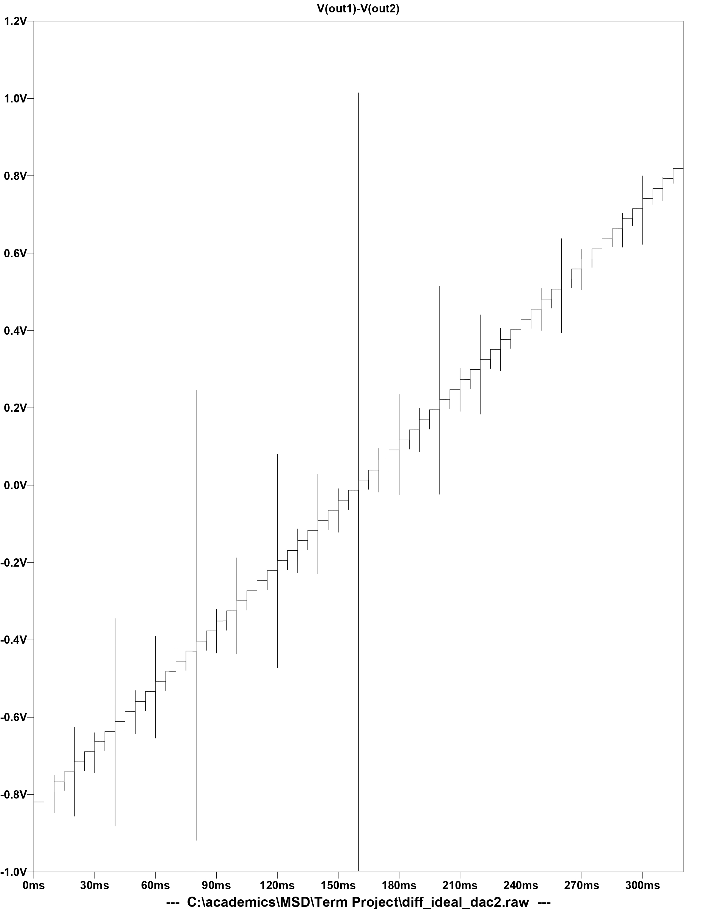

# **6-Bit Fully Differential Current Steering DAC**

## **Project Overview**
Designed and simulated a 6-bit fully differential current-steering DAC using the 180 nm CMOS process. The project emphasizes linearity, power efficiency, and robustness against transistor mismatch.

---

## **Specifications**
- **Process Technology**: 180 nm CMOS  
- **Supply Voltage**: 1.8 V  
- **Full-Scale Voltage (pk-to-pk)**: 1.6 V  
- **INL, DNL (MAX)**: 0.5 LSB  
- **Static Power Consumption**: < 1 mW  

---

## **Design and Simulations**
1. **Ideal Current Source Implementation**:  
   - Plotted transfer characteristics of the DAC.
2. **PMOS Current Source Design**:  
   - Integrated row-column decoding for current steering.
   - Simulated transfer characteristics, INL, and DNL.
3. **Mismatch Analysis**:  
   - Simulated effects of 0.1% and 1% transistor width deviations on INL and DNL.

---

## **Simulation Results**
- **Ideal DAC Transfer Characteristic**  
    
- **Non-Ideal DAC Transfer Characteristic**  
    
- **INL and DNL Plots**  
    
    

---

## **Resources**
- **Models**: Includes PMOS and NMOS models (`tsmc018.lib`) required for simulation.  
- **Results**: Contains plots and data for all simulations.

---

## **How to Run**
1. Install **LTSpice**.  
2. Include the `tsmc018.lib` model file in the schematic using `.include tsmc018.lib`.  
3. Open and simulate the files (`diff_ideal_dac2.asc`, `r_cDAC.asc`).  
4. Analyze results or refer to pre-generated plots in the **Results** folder.

---

## **Conclusion**
The project achieves key performance targets, validating the design and its robustness under mismatch conditions.

---

## **Contributor**
- **Yash Geek**  
  - [GitHub Profile](https://github.com/being-satyam)  
